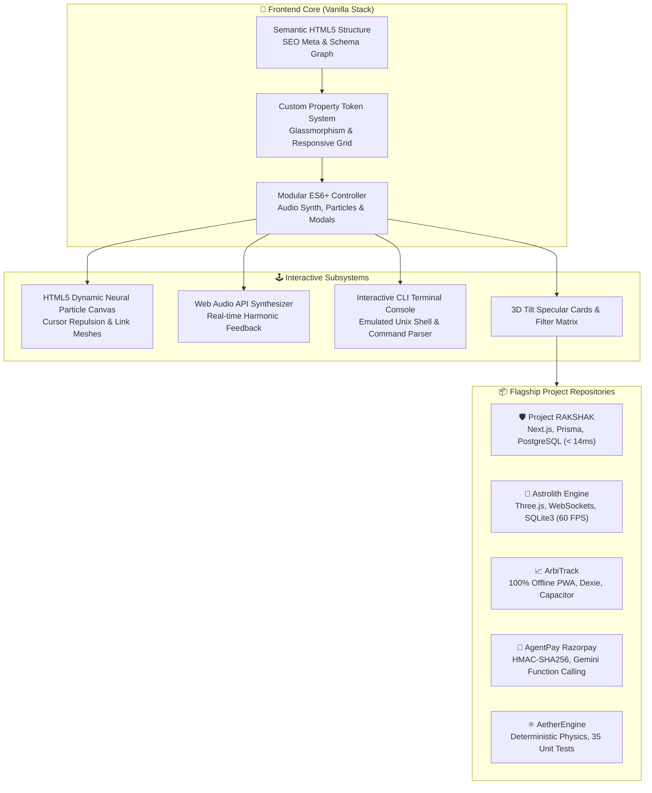

# 🚀 Portfolio v3 — Next-Gen Software Engineer & Systems Portfolio

> An ultra-modern, high-performance portfolio crafted for **Rohan Khadke** (B.Tech Computer Science & Engineering Core, Parul University).

[](LICENSE)


---

## 🏗️ Architecture & Component Topology



---

## ✨ Features & Capabilities

- **🌌 Interactive Constellation Background**: Dynamic canvas particle physics with cursor repulsion and distance-based neural link generation.
- **🎛️ Interactive CLI Terminal Playground**: Functional in-browser developer shell supporting commands like `help`, `about`, `skills`, `projects`, `benchmarks`, `rakshak`, `astrolith`, `arbitrack`, `agentpay`, `aether`, `quote`, `matrix`, `theme`, and `clear`.
- **🔊 Web Audio API Sound Synthesizer**: Built-in harmonic UI audio feedback for clicks, hovers, success triggers, and terminal execution without needing heavy audio asset downloads.
- **🎨 Glassmorphic Cyber Aesthetic**: Deep midnight slate palette with electric cyan, neon indigo, and emerald accents, backdrop filters, and subtle ambient light orbs.
- **💎 3D Tilt Hologram**: Gyroscopic/mouse-driven 3D card tilt with dynamic specular reflection coordinates.
- **⚡ Filterable Project Matrix with Quantitative Badges**:
  1. **[Project RAKSHAK](https://github.com/RohanKhadke20/Rakshak)**: Cybersecurity & Resource Node Ops Center Monorepo (`< 14ms Latency`, `Docker Instant Run`).
  2. **[Astrolith / GameInterstellar](https://github.com/RohanKhadke20/GameInterstellar)**: 3D Three.js Space Engine & WebSocket Network (`60 FPS WebGL`, `Sub-ms WS Sync`).
  3. **[ArbiTrack](https://github.com/RohanKhadke20/ArbiTrack)**: Real-Time Arbitrage Calculation Engine & Mobile-Ready PWA (`100% Offline PWA`, `1-Click Demo Pre-Seed`).
  4. **[AgentPay Razorpay](https://github.com/RohanKhadke20/agentpay-razorpay)**: Autonomous AI Agent Payment Protocol (`HMAC SHA-256`, `Gemini Function Calling`).
  5. **[AetherEngine: Orbit Collapse](https://github.com/RohanKhadke20/AetherEngine)**: Deterministic 2D Newtonian Gravity Physics Sandbox (`35/35 Unit Tests`, `Deterministic Newtonian`).
- **🔍 Project Deep-Dive Modal**: Interactive specifications, architecture breakdown, and engine telemetry metrics for every project.
- **🌓 Dark & Light Mode Support**: Smooth theme switching persisted in `localStorage`.
- **📜 Portfolio Evolution Hub**: Version comparison modal tracking the journey from v1 to v2 to v3.
- **📬 Interactive Contact Form & Clipboard Toast**: Fast messaging with mailto integration and instant copy-to-clipboard toast notifications.
- **📱 100% Responsive & Accessible**: Pixel-perfect layout across desktop, tablet, and mobile devices.

---

## 📁 Repository Structure

```text
Portfolio-v3/
├── index.html       # Semantic HTML5 with SEO meta tags & structured sections
├── styles.css       # Vanilla CSS custom property design system & glassmorphic tokens
├── script.js        # Audio synthesizer, canvas particles, CLI terminal & modal logic
├── LICENSE          # MIT License
├── CONTRIBUTING.md  # Contribution guidelines
├── .github/         # Issue templates
├── assets/
│   └── avatar.jpg   # Profile visual asset
└── README.md        # Documentation and quick start guide
```

---

## 🏃 How to Run

Simply open `index.html` in any modern web browser or serve with:

```bash
# Using Python built-in server
python -m http.server 3000

# Or using Node.js npx serve
npx serve .
```

---

## 📜 License

MIT License &copy; 2026 Rohan Khadke. Free to use, adapt, and build upon. See [LICENSE](LICENSE) for details.
